# 创建第一个Android Kotlin应用

### 创建第一个Kotlin应用程序

#### 1. 创建一个新工程

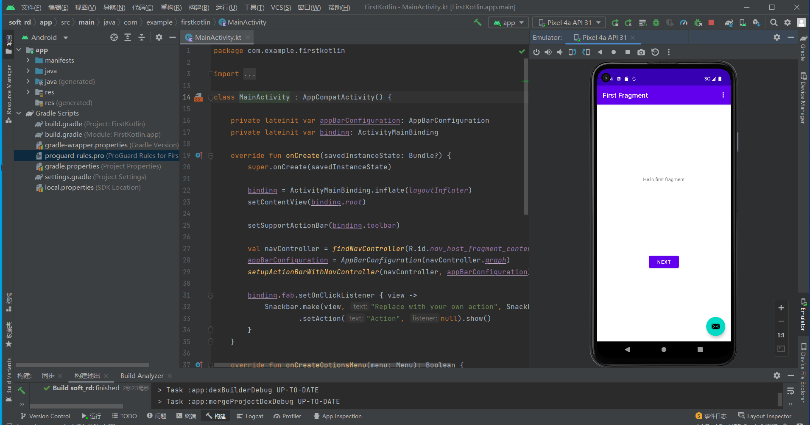

#### 2. 向页面添加更多的布局

##### 2.1添加按钮和约束

```xml

    <Button
        android:id="@+id/toast_button"
        android:layout_width="wrap_content"
        android:layout_height="wrap_content"
        android:layout_marginStart="36dp"
        android:layout_marginBottom="268dp"
        android:text="Button"
        app:layout_constraintBottom_toBottomOf="parent"
        app:layout_constraintStart_toStartOf="parent"
        app:layout_constraintTop_toBottomOf="@+id/textview_first"/>
```

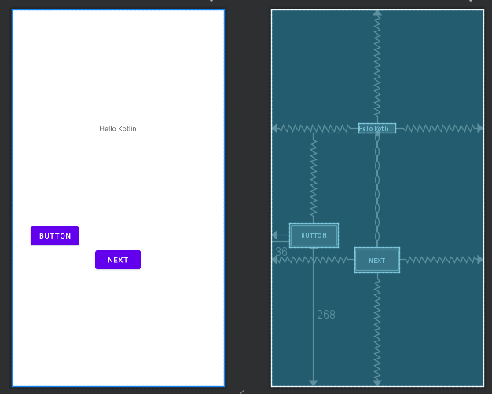

##### 2.2添加新的约束

添加Next的右边和底部约束至父类屏幕（如果不存在的话），Next的Top约束至TextView的底部。最后，TextView的底部约束至屏幕的底部。

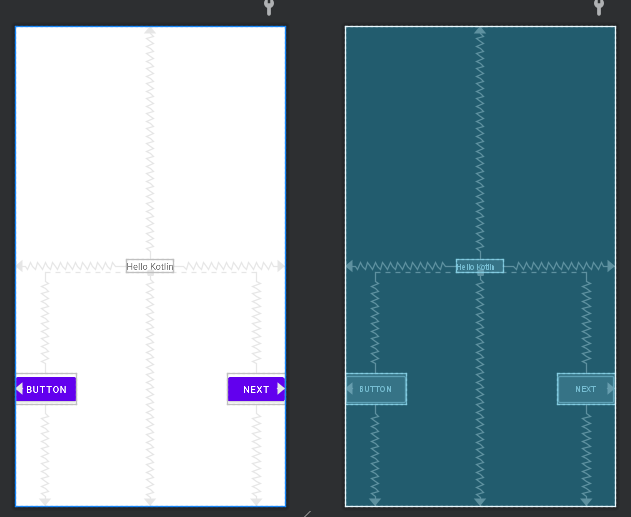

##### 2.3更改组件的文本

fragment_first.xml布局文件代码中，找到toast_button按钮的text属性部分，点击文本，左侧出现灯泡状的提示，选择 Extract string resource。

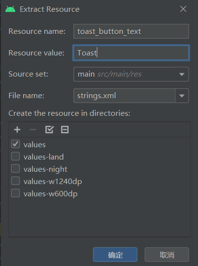

在资源文件string.xml定义了字符串，以上操作可以手动在string.xml文件中定义并引用。

```xml

    <string name="toast_button_text">Toast</string>
```

##### 2.4更新Next按钮

在string.xml文件，右键next字符串资源，选择 Refactor -> Rename，修改资源名称为random_button_text，点击Refactor 。随后，修改Next值为Random。

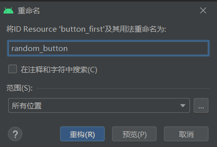

##### 2.5添加第三个按钮

向fragment_first.xml文件中添加第三个按钮，位于Toast和Random按钮之间，TextView的下方。新Button的左右约束分别约束至Toast和Random，Top约束至TextView的底部，Buttom约束至屏幕的底部。

```xml
    <Button
        android:id="@+id/button2"
        android:layout_width="wrap_content"
        android:layout_height="wrap_content"
        android:text="Button"
        app:layout_constraintStart_toEndOf="@+id/toast_button"
        app:layout_constraintEnd_toStartOf="@+id/random_button"
        app:layout_constraintTop_toBottomOf="@+id/textview_first"
        app:layout_constraintBottom_toBottomOf="parent" />
```

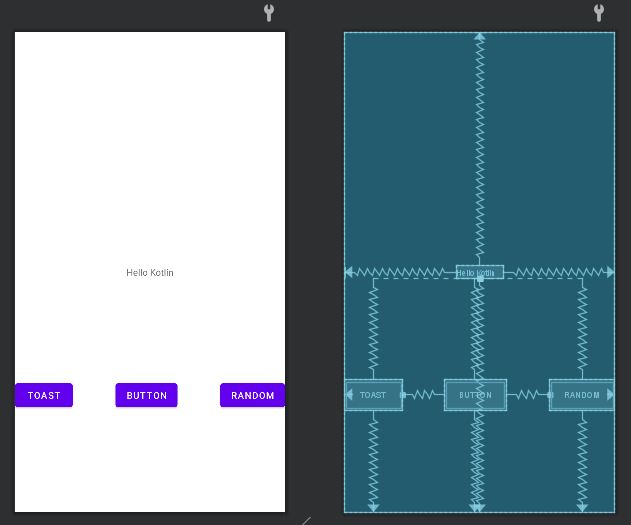

##### 2.6完善UI组件的属性设置

```xml

    <?xml version="1.0" encoding="utf-8"?>
<androidx.constraintlayout.widget.ConstraintLayout xmlns:android="http://schemas.android.com/apk/res/android"
    xmlns:app="http://schemas.android.com/apk/res-auto"
    xmlns:tools="http://schemas.android.com/tools"
    android:layout_width="match_parent"
    android:layout_height="match_parent"
    tools:context=".FirstFragment">

    <TextView
        android:id="@+id/textview_first"
        android:layout_width="wrap_content"
        android:layout_height="wrap_content"
        android:text="@string/hello_first_fragment"
        android:fontFamily="sans-serif-condensed"
        android:textColor="@android:color/darker_gray"
        android:textSize="30sp"
        android:textStyle="bold"
        app:layout_constraintBottom_toBottomOf="parent"
        app:layout_constraintEnd_toEndOf="parent"
        app:layout_constraintStart_toStartOf="parent"
        app:layout_constraintTop_toTopOf="parent" />

    <Button
        android:id="@+id/random_button"
        android:layout_width="wrap_content"
        android:layout_height="wrap_content"
        android:text="@string/next"
        app:layout_constraintBottom_toBottomOf="parent"
        app:layout_constraintEnd_toEndOf="parent"
        app:layout_constraintTop_toBottomOf="@id/textview_first" />

    <Button
        android:id="@+id/toast_button"
        android:layout_width="wrap_content"
        android:layout_height="wrap_content"
        android:text="@string/toast_button_text"
        app:layout_constraintBottom_toBottomOf="parent"
        app:layout_constraintStart_toStartOf="parent"
        app:layout_constraintTop_toBottomOf="@+id/textview_first" />

    <Button
        android:id="@+id/count_button"
        android:layout_width="wrap_content"
        android:layout_height="wrap_content"
        android:text="Count"
        app:layout_constraintStart_toEndOf="@+id/toast_button"
        app:layout_constraintEnd_toStartOf="@+id/random_button"
        app:layout_constraintTop_toBottomOf="@+id/textview_first"
        app:layout_constraintBottom_toBottomOf="parent" />
</androidx.constraintlayout.widget.ConstraintLayout>

```

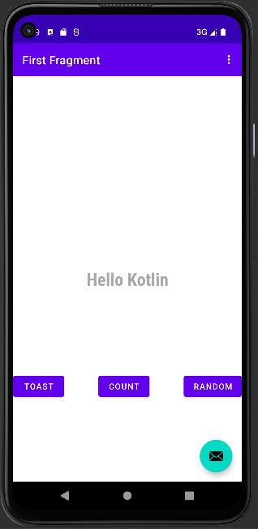

#### 3. 更新按钮和文本框外观

##### 3.1 添加新的颜色资源

在values>colors.xml定义了一些应用程序可以使用的颜色

```xml
    <color name="screenBackground">#2196F3</color>
    <color name="buttonBackground">#BBDEFB</color>
```

##### 3.2 设置组件的外观

3.1.1 设置屏幕背景色

```xml
    android:background="@color/screenBackground"
```

3.1.2 设置按钮颜色

```xml
    android:background="@color/buttonBackground"
```

```xml
    <style name="Theme.FirstKotlin" parent="Theme.MaterialComponents.DayNight.DarkActionBar.Bridge">
```

   3.1.3 移除TextView的背景颜色，设置TextView的文本颜色为color/white，并增大字体大小至72sp

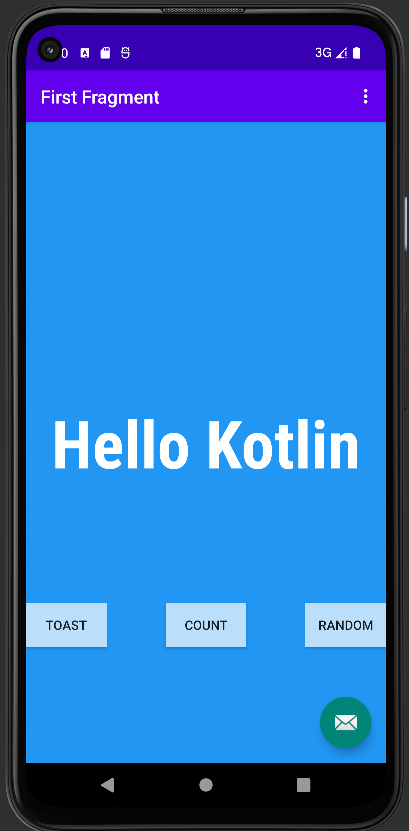

##### 3.3 设置组件位置

Toast与屏幕的左边距设置为24dp，Random与屏幕的右边距设置为24dp。

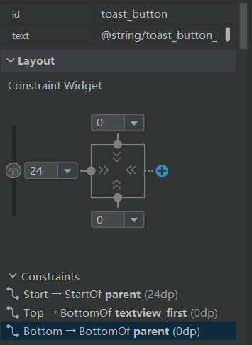

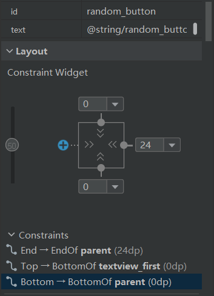

设置TextView的垂直偏移为0.3

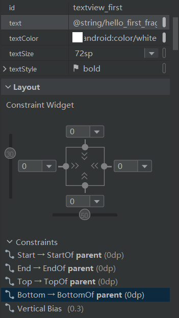

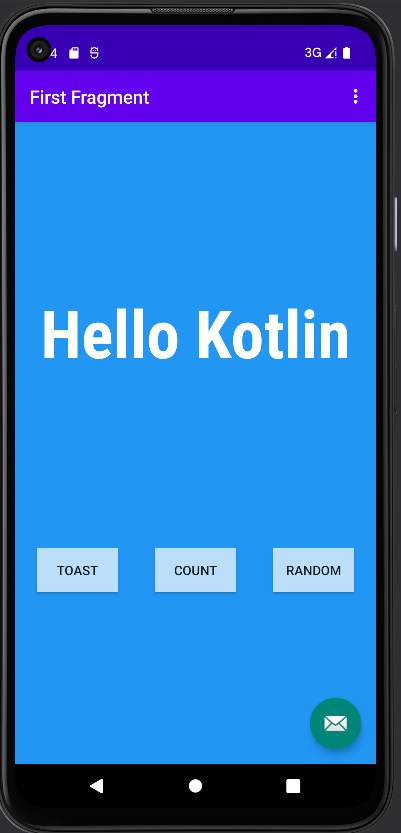

#### 4. 添加代码完成应用程序交互

##### 4.1 设置代码自动补全

依次点击文件->新项目设置->新的项目设置->其他设置->自动导入，在java和Kotlin选择快速添加清晰的导入

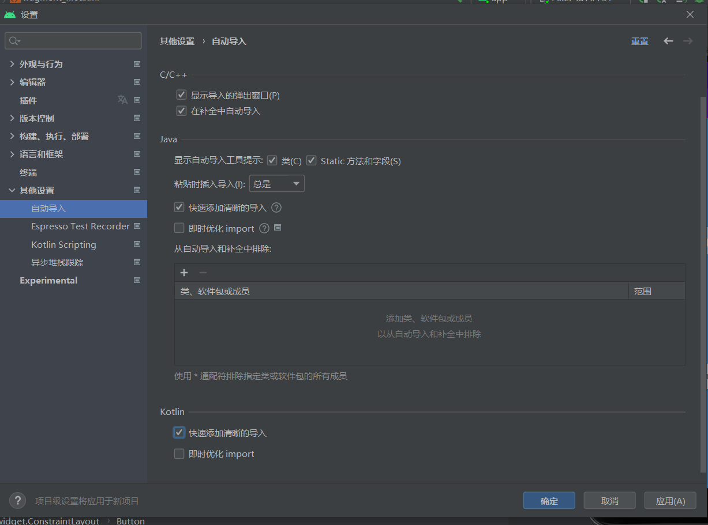

##### 4.2 TOAST按钮添加一个toast消息

在onViewCreated方法中使用绑定机制设置按钮的响应事件（创建应用程序时自带的按钮）

```Kotlin

    binding.randomButton.setOnClickListener {
                findNavController().navigate(R.id.action_FirstFragment_to_SecondFragment)
            }
//为TOAST按钮添加事件
        view.findViewById<Button>(R.id.toast_button).setOnClickListener{
            val myToast = Toast.makeText(context,"Hello Toast!",Toast.LENGTH_LONG)
            myToast.show();
        }

```

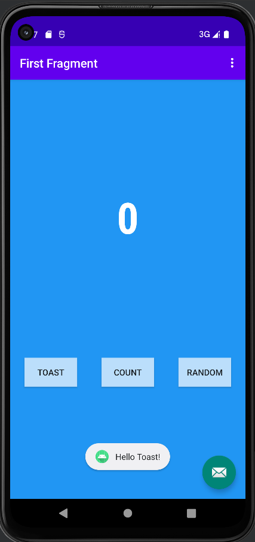

##### 4.3 Count按钮更新屏幕的数字

向Count按钮添加事件响应，更新Textview的文本显示。在FirstFragment.kt文件，为count_buttion按钮添加事件：

```Kotlin
    view.findViewById<Button>(R.id.count_button).setOnClickListener {
            countMe(view)
        }
```

countMe()为自定义方法，以View为参数，每次点击增加数字1:

```Kotlin
    private fun countMe(view: View){
        val showCountTextView = view.findViewById<TextView>(R.id.textview_first)
        val  countstring = showCountTextView.text.toString()
        var  count = countstring.toInt()
        count++
        showCountTextView.text = count.toString()
    }

```

### 5.完成第二界面代码

按照First Fragment显示数字作为上限，随机在Second Fragment上显示一个数字，即Random按钮的事件响应。

##### 5.1 向界面添加TextView显示随机数

```xml
    <TextView
        android:id="@+id/textview_random"
        android:layout_width="wrap_content"
        android:layout_height="wrap_content"
        android:text="R"
        android:textSize="72sp"
        android:textStyle="bold"
        app:layout_constraintVertical_bias="0.45"
        app:layout_constraintEnd_toEndOf="parent"
        app:layout_constraintStart_toStartOf="parent"
        app:layout_constraintTop_toBottomOf="@+id/textview_second"
        app:layout_constraintBottom_toBottomOf="@+id/button_second"/>

```

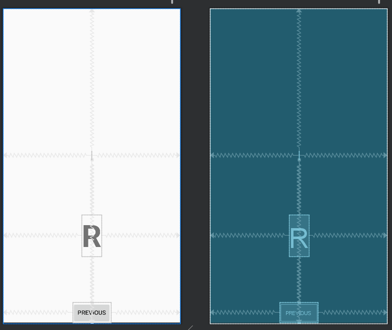

##### 5.2 更新显示界面文本的TextView(textview_second)

```xml
    <TextView
        android:id="@+id/textview_header"
        android:layout_width="match_parent"
        android:layout_height="wrap_content"
        android:layout_marginLeft="24dp"
        android:layout_marginRight="24dp"
        android:layout_marginStart="24dp"
        android:layout_marginTop="24dp"
        android:layout_marginEnd="24dp"
        android:textColor="@color/colorPrimaryDark"
        android:text="@string/random_heading"
        android:textSize="24sp"
        app:layout_constraintEnd_toEndOf="parent"
        app:layout_constraintStart_toStartOf="parent"
        app:layout_constraintTop_toTopOf="parent" />

```

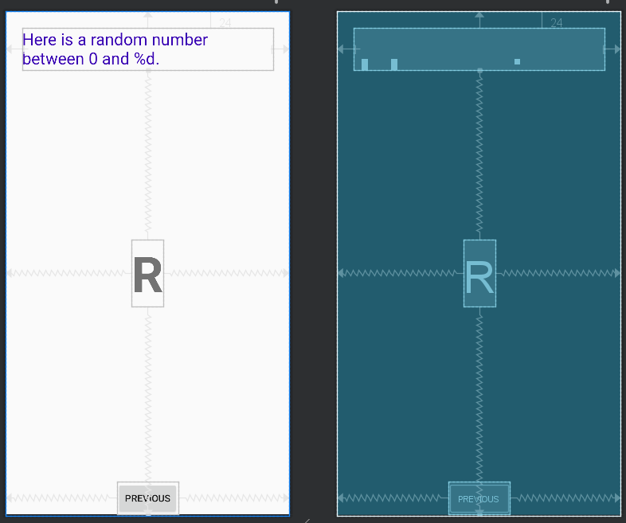

##### 5.3 更改揭秘那的背景颜色和按钮布局

向colors.xml文件添加第二个Fragment背景色的值，修改fragment_second.xml背景色的属性为screenBackground2

```xml
    <color name="screenBackground2">#26C6DA</color>
```

##### 5.4 检查导航图

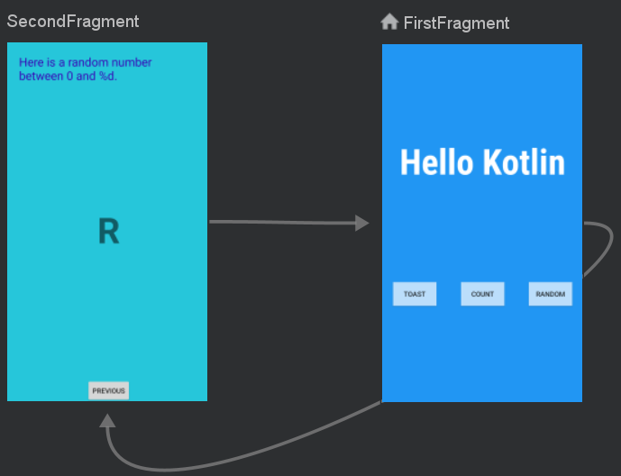

##### 5.5 启用SafeArgs

Navigation 组件具有一个名为 Safe Args 的 Gradle 插件，该插件可以生成简单的 object 和 builder 类，以便以类型安全的方式浏览和访问任何关联的参数。

导入依赖：

```gradle
   implementation("androidx.navigation:navigation-fragment-ktx:2.5.0")
   implementation("androidx.navigation:navigation-ui-ktx:2.5.0")
```

Gradle的Project部分，在plungins添加：

```gradle
    id 'androidx.navigation.safeargs.kotlin' version '2.5.0' apply false

```

module部分在plugins节添加

```gradle
    id 'androidx.navigation.safeargs.kotlin'
```

##### 5.6 创建导航动作

1. 打开导航视图，点击FirstFragment，查看其属性。

2. 在Actions栏中可以看到导航至SecondFragment

3. 同理，查看SecondFragment的属性栏

4. 点击Arguments **+**符号

5. 弹出的对话框中，添加参数myArg，类型为整型Integer

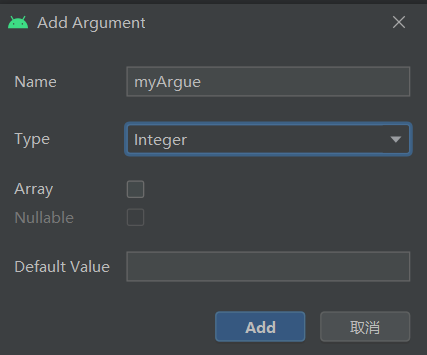

##### 5.7FirstFragment添加代码，向SecondFragment发数据

初始应用中，点击FirstFragment的Random按钮将跳转到第二个页面，但没有传递数据。在本步骤中将获取当前TextView中显示的数字并传输至SecondFragment。

1. 找到onViewCreated()方法，该方法在onCreateView方法之后被调用，可以实现组件的初始化。找到Random按钮的响应代码，注释掉原先的事件处理代码实例化TextView，获取TextView中文本并转换为整数值。

```kotlin
    val showCountTextView = view.findViewById<TextView>(R.id.textview_first)
    val currentCount = showCountTextView.text.toString().toInt()
```

2. 将currentCount作为参数传递给actionFirstFragmentToSecondFragment()

```kotlin
    val action = FirstFragmentDirections.actionFirstFragmentToSecondFragment(currentCount)
```

3. 添加导航事件代码

```kotlin
    findNavController().navigate(action)
```

##### 5.8 添加SecondFragment的代码

1. 导入navArgs包

```kotlin
    import  androidx.navigation.fragment.navArgs
```

2. onViewCreated()代码之前添加一行

```kotlin
    val  args: SecondFragmentArgs by navArgs()
```

3. onViewCreated()中获取传递过来的参数列表，提取count数值，并在textview_header中显示

```kotlin
    val count = args.myArg
    val countText = getString(R.string.random_heading,count)
    view.findViewById<TextView>(R.id.textview_header).text = countText
```

4. 根据count值生成随机数

```kotlin
    var randomNumber = 0
    if (count > 0){
         randomNumber = random.nextInt(count+1)
    }
```

5. textview_random中显示count值

```kotlin
    view.findViewById<TextView>(R.id.textview_random).text = randomNumber.toString()
```

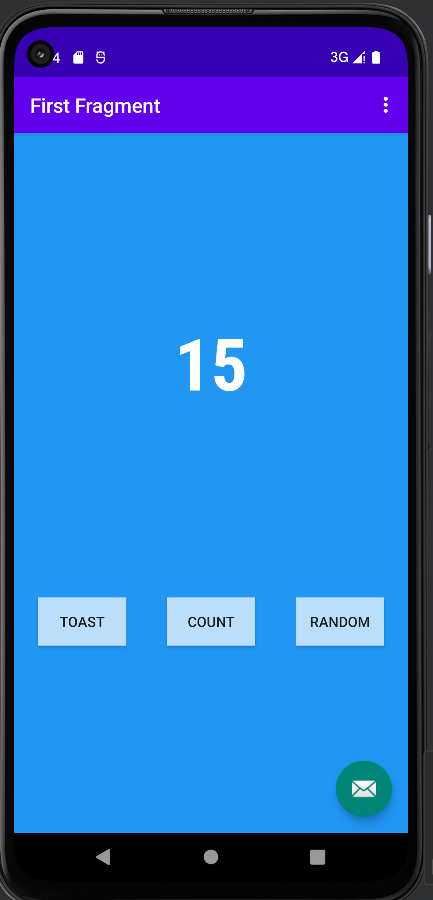
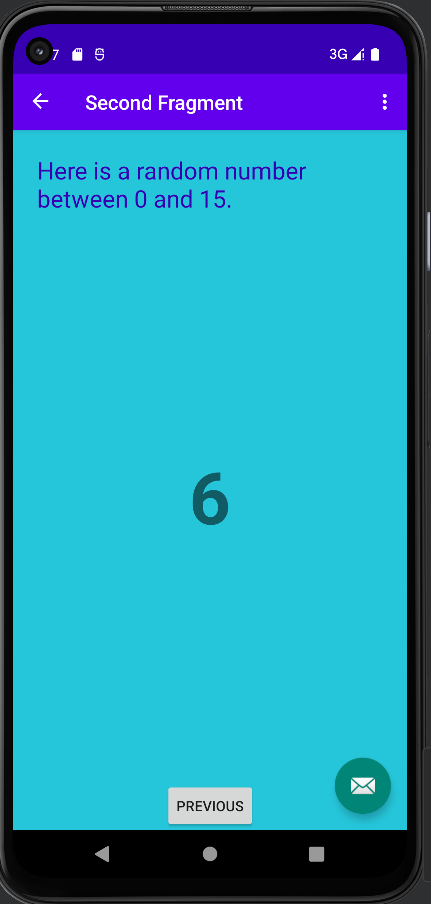

### 遇到的问题及解决

问题一：

```gradle

Duplicate class androidx.lifecycle.ViewModelLazy found in modules jetified-lifecycle-viewmodel-ktx-2.3.1-runtime (androidx.lifecycle:lifecycle-viewmodel-ktx:2.3.1) and lifecycle-viewmodel-2.4.0-runtime (androidx.lifecycle:lifecycle-viewmodel:2.4.0)
Duplicate class androidx.lifecycle.ViewModelProviderKt found in modules jetified-lifecycle-viewmodel-ktx-2.3.1-runtime (androidx.lifecycle:lifecycle-viewmodel-ktx:2.3.1) and lifecycle-viewmodel-2.4.0-runtime (androidx.lifecycle:lifecycle-viewmodel:2.4.0)
Duplicate class androidx.lifecycle.ViewTreeViewModelKt found in modules jetified-lifecycle-viewmodel-ktx-2.3.1-runtime (androidx.lifecycle:lifecycle-viewmodel-ktx:2.3.1) and lifecycle-viewmodel-2.4.0-runtime (androidx.lifecycle:lifecycle-viewmodel:2.4.0)
```

解决：

1. 依赖项解析错误，提醒为重复类异常，实际上就是使用kotlin相关类库的版本问题
2. 若项目中未设置过kotlin相关依赖库版本，可在build.gradle文件中的dependencies 中添加如下代码

```gradle
implementation 'androidx.lifecycle:lifecycle-viewmodel-ktx:2.4.0'
```

3. 若项目中已经设置过相关依赖库版本，在build.gradle文件中找到设置的依赖库位置，更改对应的版本号即可，异常中提示更改为“2.4.0”，若你的异常提醒为其他版本，道理是一样的，改为项目提示的异常更高级版本号即可

问题二：

```gradle
Too many arguments for public final fun actionFirstFragmentToSecondFragment(): NavDirections defined in com.example.firstkotlin.FirstFragmentDirections.Companion
```

解决：在5.6创建导航动作中，未添加参数。
