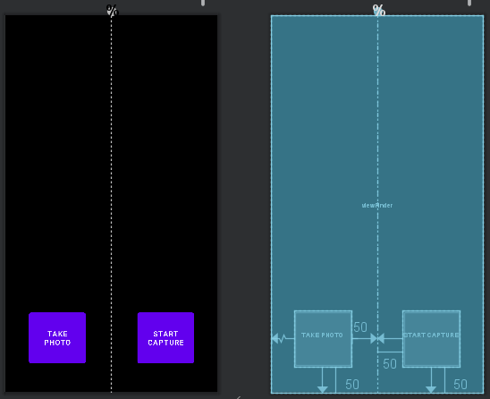
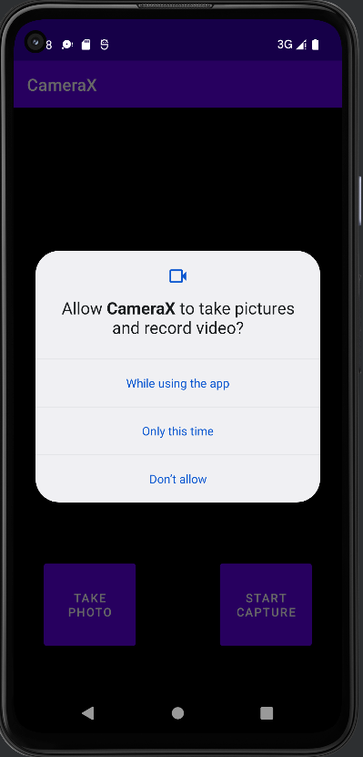
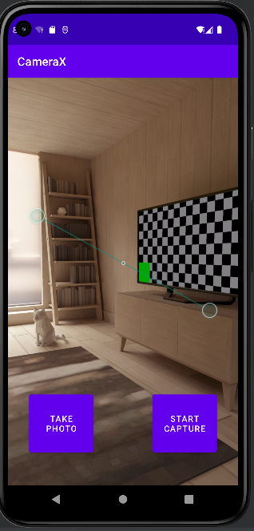
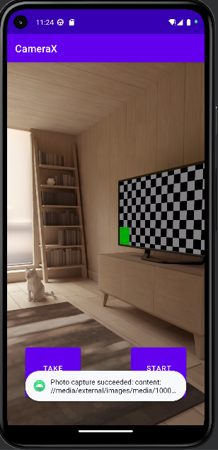
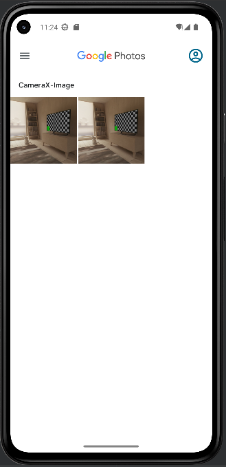
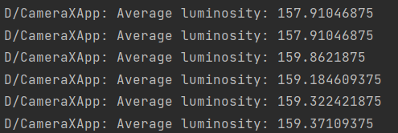
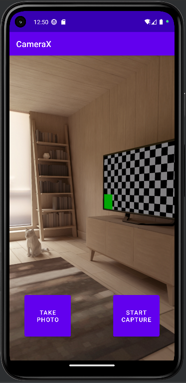
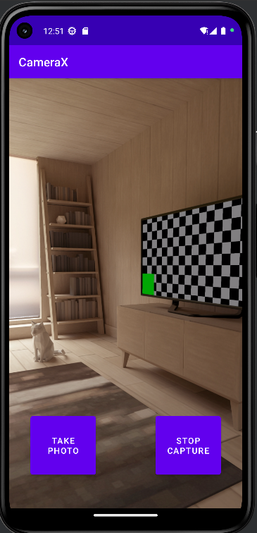
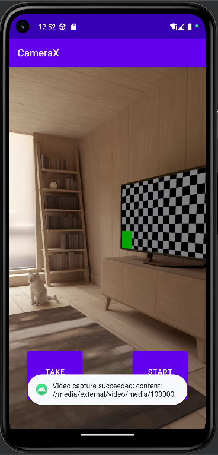
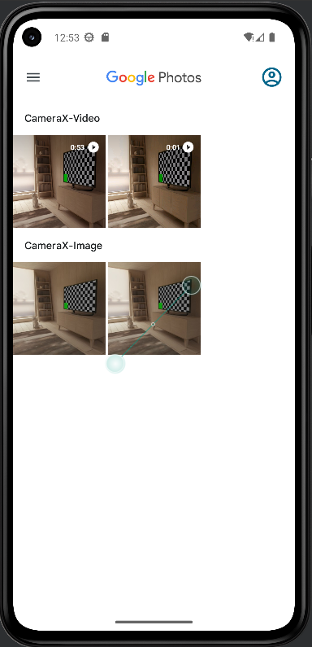

# Android CameraX的基础使用

#### 1. 创建项目

##### 1.1 添加Gradle依赖

在项目模块的build.gradle文件，添加CameraX依赖项

```gradle
    def camerax_version = "1.1.0-beta01"
        implementation "androidx.camera:camera-core:${camerax_version}"
        implementation "androidx.camera:camera-camera2:${camerax_version}"
        implementation "androidx.camera:camera-lifecycle:${camerax_version}"
         implementation "androidx.camera:camera-video:${camerax_version}"
        implementation "androidx.camera:camera-view:${camerax_version}"
        implementation "androidx.camera:camera-extensions:${camerax_version}"
```

项目中使用了ViewBinding，在android{}代码末端添加：

```gradle

    buildFeatures {
        viewBinding true
    }
```

##### 1.2 创建项目布局

涉及功能：

1. 预览相机图片/视频
2. 图片拍摄的标准按钮
3. 开始/停止拍摄标准按钮

activity.main布局文件：

```xml
<?xml version="1.0" encoding="utf-8"?>
<androidx.constraintlayout.widget.ConstraintLayout xmlns:android="http://schemas.android.com/apk/res/android"
    xmlns:app="http://schemas.android.com/apk/res-auto"
    xmlns:tools="http://schemas.android.com/tools"
    android:layout_width="match_parent"
    android:layout_height="match_parent"
    tools:context=".MainActivity">
    <androidx.camera.view.PreviewView
        android:id="@+id/viewFinder"
        android:layout_width="match_parent"
        android:layout_height="match_parent" />

        <Button
         android:id="@+id/image_capture_button"
         android:layout_width="110dp"
         android:layout_height="110dp"
         android:layout_marginBottom="50dp"
         android:layout_marginEnd="50dp"
         android:elevation ="2dp"
         android:text="@string/take_photo"
         app:layout_constraintBottom_toBottomOf="parent"
         app:layout_constraintLeft_toLeftOf="parent"
         app:layout_constraintEnd_toStartOf="@+id/vertical_centerline"/>

    <Button
        android:id="@+id/video_capture_button"
        android:layout_width="110dp"
        android:layout_height="110dp"
        android:layout_marginBottom="50dp"
        android:layout_marginStart="50dp"
        android:elevation="2dp"
        android:text="@string/start_capture"
        app:layout_constraintBottom_toBottomOf="parent"
        app:layout_constraintStart_toEndOf="@id/vertical_centerline" />

    <androidx.constraintlayout.widget.Guideline
        android:id="@+id/vertical_centerline"
        android:layout_width="wrap_content"
        android:layout_height="wrap_content"
        android:orientation="vertical"
        app:layout_constraintGuide_percent=".50"/>

</androidx.constraintlayout.widget.ConstraintLayout>

```




##### 1.3 编写MainActivity.kt代码

系统已实现 onCreate()，供我们检查相机权限、启动相机、为照片和拍摄按钮设置 onClickListener()，以及实现 cameraExecutor。虽然系统已经实现 onCreate()，但在实现文件中的方法之前，相机将无法正常工作。

```kotlin

package com.example.camerax

import com.example.camerax.databinding.ActivityMainBinding
import android.Manifest
import android.content.ContentValues
import android.content.pm.PackageManager
import android.os.Build
import android.os.Bundle
import android.provider.MediaStore
import androidx.appcompat.app.AppCompatActivity
import androidx.camera.core.ImageCapture
import androidx.camera.video.Recorder
import androidx.camera.video.Recording
import androidx.camera.video.VideoCapture
import androidx.core.app.ActivityCompat
import androidx.core.content.ContextCompat
import java.util.concurrent.ExecutorService
import java.util.concurrent.Executors
import android.widget.Toast
import androidx.camera.lifecycle.ProcessCameraProvider
import androidx.camera.core.Preview
import androidx.camera.core.CameraSelector
import android.util.Log
import androidx.camera.core.ImageAnalysis
import androidx.camera.core.ImageCaptureException
import androidx.camera.core.ImageProxy
import androidx.camera.video.FallbackStrategy
import androidx.camera.video.MediaStoreOutputOptions
import androidx.camera.video.Quality
import androidx.camera.video.QualitySelector
import androidx.camera.video.VideoRecordEvent
import androidx.core.content.PermissionChecker
import java.nio.ByteBuffer
import java.text.SimpleDateFormat
import java.util.Locale


typealias LumaListener = (luma: Double) -> Unit

class MainActivity : AppCompatActivity() {
    private  lateinit var viewBinding : ActivityMainBinding

    private  var imageCapture: ImageCapture? =null
    private  var  vedioCapture :VideoCapture<Recorder>? = null
    private var recording: Recording? = null
    private lateinit var cameraExecutor: ExecutorService

    override fun onCreate(savedInstanceState: Bundle?) {
        super.onCreate(savedInstanceState)
        viewBinding = ActivityMainBinding.inflate(layoutInflater)
        setContentView(R.layout.activity_main)

        if (allPermissionsGranted()) {
            startCamera()
        } else {
            ActivityCompat.requestPermissions(
                this, REQUIRED_PERMISSIONS, REQUEST_CODE_PERMISSIONS)
        }

        // Set up the listeners for take photo and video capture buttons
        viewBinding.imageCaptureButton.setOnClickListener { takePhoto() }
        viewBinding.videoCaptureButton.setOnClickListener { captureVideo() }

        cameraExecutor = Executors.newSingleThreadExecutor()
    }

    private fun takePhoto(){}
    private fun captureVideo(){}
    private fun startCamera(){}

    private fun  allPermissionsGranted() = REQUIRED_PERMISSIONS.all{
        ContextCompat.checkSelfPermission(
            baseContext, it) == PackageManager.PERMISSION_GRANTED
    }

    override fun onDestroy() {
        super.onDestroy()
        cameraExecutor.shutdown()
    }
    companion object {
        private const val TAG = "CameraX"
        private const val FILENAME_FORMAT = "yyyy-MM-dd-HH-mm-ss-SSS"
        private const val REQUEST_CODE_PERMISSIONS = 10
        private val REQUIRED_PERMISSIONS =
            mutableListOf (
                Manifest.permission.CAMERA,
                Manifest.permission.RECORD_AUDIO
            ).apply {
                if (Build.VERSION.SDK_INT <= Build.VERSION_CODES.P) {
                    add(Manifest.permission.WRITE_EXTERNAL_STORAGE)
                }
            }.toTypedArray()
    }
}

```

#### 2.请求权限

添加到AndroidManifest.xml文件application前

```xml
<uses-feature android:name="android.hardware.camera.any" />
    <uses-permission android:name="android.permission.CAMERA" />
    <uses-permission android:name="android.permission.RECORD_AUDIO" />
    <uses-permission android:name="android.permission.WRITE_EXTERNAL_STORAGE" android:maxSdkVersion="28" />
```

添加 android.hardware.camera.any 可确保设备配有相机。指定 .any 表示它可以是前置摄像头，也可以是后置摄像头。

复制代码到MainActivity.kt中

```kotlin
override fun onRequestPermissionsResult(
   requestCode: Int, permissions: Array<String>, grantResults:
   IntArray) {
   super.onRequestPermissionsResult(requestCode, permissions, grantResults)
   if (requestCode == REQUEST_CODE_PERMISSIONS) {
       if (allPermissionsGranted()) {
           startCamera()
       } else {
           Toast.makeText(this,
               "Permissions not granted by the user.",
               Toast.LENGTH_SHORT).show()
           finish()
       }
   }
}
```

```kotlin
if (requestCode == REQUEST_CODE_PERMISSIONS) {
}
//检查请求代码是否正确；否则，忽略它
```

```kotlin
if (allPermissionsGranted()) {
        startCamera()
    }else {
           Toast.makeText(this,
               "Permissions not granted by the user.",
               Toast.LENGTH_SHORT).show()
           finish()
       }
//判断是否已授予权限，若是则调用 startCamera() （进行预览）；如果未授予权限，系统会显示一个消息框，通知用户未授予权限
```



#### 3.实现Preview用例

在相机应用中，取景器用于让用户预览他们拍摄的照片。使用 CameraX Preview 类实现取景器。

如需使用 Preview，首先需要定义一个配置，然后系统会使用该配置创建用例的实例。生成的实例就是绑定到 CameraX 生命周期的内容。填充之前的startCamera() 函数。

1. 创建 ProcessCameraProvider 的实例。这用于将相机的生命周期绑定到生命周期所有者。这消除了打开和关闭相机的任务,CameraX 具有生命周期感知能力。

```kotlin
val cameraProviderFuture = ProcessCameraProvider.getInstance(this)
```

2. 向 cameraProviderFuture 添加监听器。添加 Runnable 作为一个参数。添加 ContextCompat.getMainExecutor() 作为第二个参数。这将返回一个在主线程上运行的 Executor。

```kotlin
cameraProviderFuture.addListener(Runnable {}, ContextCompat.getMainExecutor(this))
```

3. 在 Runnable 中，添加 ProcessCameraProvider。它用于将相机的生命周期绑定到应用进程中的 LifecycleOwner。

```kotlin
val cameraProvider: ProcessCameraProvider = cameraProviderFuture.get()
```

4. 初始化 Preview 对象，在其上调用 build，从取景器中获取 Surface 提供程序，然后在预览上进行设置。

```kotlin
val preview = Preview.Builder()
   .build()
   .also {
       it.setSurfaceProvider(viewBinding.viewFinder.surfaceProvider)
   }
```

5. 创建 CameraSelector 对象，然后选择 DEFAULT_BACK_CAMERA。

```kotlin
val cameraSelector = CameraSelector.DEFAULT_BACK_CAMERA
```

```kotlin
val preview = Preview.Builder()
   .build()
   .also {
       it.setSurfaceProvider(viewBinding.viewFinder.surfaceProvider)
   }
```

6. 创建一个 try 代码块。在此块内，确保没有任何内容绑定到 cameraProvider，然后将 cameraSelector 和预览对象绑定到 cameraProvider。

```kotlin
try {
   cameraProvider.unbindAll()
   cameraProvider.bindToLifecycle(
       this, cameraSelector, preview)
}

```

7. 有多种原因可能会导致此代码失败，例如应用不再获得焦点。将此代码封装到 catch 块中，以便在出现故障时记录日志。

```kotlin
catch(exc: Exception) {
      Log.e(TAG, "Use case binding failed", exc)
}
```

```kotlin

private fun startCamera() {
   val cameraProviderFuture = ProcessCameraProvider.getInstance(this)

   cameraProviderFuture.addListener({
       // Used to bind the lifecycle of cameras to the lifecycle owner
       val cameraProvider: ProcessCameraProvider = cameraProviderFuture.get()

       // Preview
       val preview = Preview.Builder()
          .build()
          .also {
              it.setSurfaceProvider(viewBinding.viewFinder.surfaceProvider)
          }

       // Select back camera as a default
       val cameraSelector = CameraSelector.DEFAULT_BACK_CAMERA

       try {
           // Unbind use cases before rebinding
           cameraProvider.unbindAll()

           // Bind use cases to camera
           cameraProvider.bindToLifecycle(
               this, cameraSelector, preview)

       } catch(exc: Exception) {
           Log.e(TAG, "Use case binding failed", exc)
       }

   }, ContextCompat.getMainExecutor(this))
}

```



#### 4.实现拍照功能

首先，定义一个配置对象，该对象用于实例化实际用例对象。若要拍摄照片，需要实现 takePhoto() 方法，该方法会在用户按下 photo 按钮时调用。填充takePhoto() 方法的代码：

1. 获取对 ImageCapture 用例的引用。如果用例为 null，退出函数。如果在设置图片拍摄之前点按“photo”按钮，它将为 null。如果没有 return 语句，应用会在该用例为 null 时崩溃。

```kotlin
val imageCapture = imageCapture ?: return
```

2. 创建用于保存图片的 MediaStore 内容值。使用时间戳，确保 MediaStore 中的显示名是唯一的。

```kotlin
val name = SimpleDateFormat(FILENAME_FORMAT, Locale.US)
              .format(System.currentTimeMillis())
   val contentValues = ContentValues().apply {
       put(MediaStore.MediaColumns.DISPLAY_NAME, name)
       put(MediaStore.MediaColumns.MIME_TYPE, "image/jpeg")
       if(Build.VERSION.SDK_INT > Build.VERSION_CODES.P) {
           put(MediaStore.Images.Media.RELATIVE_PATH, "Pictures/CameraX-Image")
       }
   }

```

3. 创建一个 OutputFileOptions 对象。在该对象中，可以指定所需的输出内容。我们希望将输出保存在 MediaStore 中，以便其他应用可以显示它，因此，添加 MediaStore 条目。

```kotlin
val outputOptions = ImageCapture.OutputFileOptions
       .Builder(contentResolver,
                MediaStore.Images.Media.EXTERNAL_CONTENT_URI,
                contentValues)
       .build()
```

4. 对 imageCapture 对象调用 takePicture()。传入 outputOptions、执行器和保存图片时使用的回调。接下来，需要完成回调。

```kotlin
imageCapture.takePicture(
   outputOptions, ContextCompat.getMainExecutor(this),
   object : ImageCapture.OnImageSavedCallback {}
)

```

5. 图片拍摄失败或保存图片失败，添加错误情况以记录失败。

```kotlin
override fun onError(exc: ImageCaptureException) {
   Log.e(TAG, "Photo capture failed: ${exc.message}", exc)
}

```

6. 如果拍摄未失败，即表示照片拍摄成功.将照片保存到之前创建的文件中，显示消息框，让用户知道照片已拍摄成功，并输出日志语句。

```kotlin
override fun onImageSaved(output: ImageCapture.OutputFileResults) {
   val savedUri = Uri.fromFile(photoFile)
   val msg = "Photo capture succeeded: $savedUri"
   Toast.makeText(baseContext, msg, Toast.LENGTH_SHORT).show()
   Log.d(TAG, msg)
}
```

7. 在startCamera() 方法中添加：

 ```kotlin
imageCapture = ImageCapture.Builder().build()
 ```

8. 在 try 代码块中更新对 bindToLifecycle() 的调用，以包含新的用例

```kotlin
cameraProvider.bindToLifecycle(
   this, cameraSelector, preview, imageCapture)

```





####  5.实现 ImageAnalysis 用例

使用 ImageAnalysis 功能可让相机应用变得更加有趣。它允许定义实现 ImageAnalysis.Analyzer 接口的自定义类，并使用传入的相机帧调用该类。无需管理相机会话状态，甚至无需处理图像；与其他生命周期感知型组件一样，仅绑定到应用所需的生命周期就足够了。

将此分析器添加为 MainActivity.kt 中的内部类。分析器会记录图像的平均亮度。如需创建分析器，我们会替换实现 ImageAnalysis.Analyzer 接口的类中的 analyze 函数。

```kotlin
private class LuminosityAnalyzer(private val listener: LumaListener) : ImageAnalysis.Analyzer {

   private fun ByteBuffer.toByteArray(): ByteArray {
       rewind()    // Rewind the buffer to zero
       val data = ByteArray(remaining())
       get(data)   // Copy the buffer into a byte array
       return data // Return the byte array
   }

   override fun analyze(image: ImageProxy) {

       val buffer = image.planes[0].buffer
       val data = buffer.toByteArray()
       val pixels = data.map { it.toInt() and 0xFF }
       val luma = pixels.average()

       listener(luma)

       image.close()
   }
}
```

在类中实现 ImageAnalysis.Analyzer 接口后，只需在 ImageAnalysis中实例化一个 LuminosityAnalyzer 实例（与其他用例类似），并再次更新 startCamera() 函数，然后调用 CameraX.bindToLifecycle() 即可

更新startCamera()，在imageCapture 代码下方添加

```kotlin
 val imageAnalyzer = ImageAnalysis.Builder()
            .build()
            .also {
                it.setAnalyzer(cameraExecutor, LuminosityAnalyzer { luma ->
                    Log.d(TAG, "Average luminosity: $luma")
                })
            }
```

更新 cameraProvider 上的 bindToLifecycle() 调用，包含 imageAnalyzer

```kotlin
cameraProvider.bindToLifecycle(
   this, cameraSelector, preview, imageCapture, imageAnalyzer)
```



#### 6.实现 VideoCapture 用例（拍摄视频）

1. 首先检查是否已创建 VideoCapture 用例：如果尚未创建，则不执行任何操作

```kotlin
val videoCapture = videoCapture ?: return

```

2. 在 CameraX 完成请求操作之前，停用界面；在后续步骤中，它会在已注册的 VideoRecordListener 内重新启用。

```kotlin
viewBinding.videoCaptureButton.isEnabled = false
```

3. 如果有正在进行的录制操作，将其停止并释放当前的 recording。当所捕获的视频文件可供应用使用时，我们会收到通知。

```kotlin
val curRecording = recording
if (curRecording != null) {
    curRecording.stop()
    recording = null
    return
}

```

4. 为了开始录制，创建一个新的录制会话。首先，创建预定的 MediaStore 视频内容对象，将系统时间戳作为显示名（以便可以捕获多个视频）。

```kotlin
val name = SimpleDateFormat(FILENAME_FORMAT, Locale.US)
           .format(System.currentTimeMillis())
val contentValues = ContentValues().apply {
       put(MediaStore.MediaColumns.DISPLAY_NAME, name)
       put(MediaStore.MediaColumns.MIME_TYPE, "video/mp4")
       if (Build.VERSION.SDK_INT > Build.VERSION_CODES.P) {
           put(MediaStore.Video.Media.RELATIVE_PATH,
               "Movies/CameraX-Video")
       }
}
```

5. 使用外部内容选项创建 MediaStoreOutputOptions.Builder

```kotlin
val mediaStoreOutputOptions = MediaStoreOutputOptions
      .Builder(contentResolver,
               MediaStore.Video.Media.EXTERNAL_CONTENT_URI)
```

6. 将创建的视频 contentValues 设置为 MediaStoreOutputOptions.Builder，并构建我们的 MediaStoreOutputOptions 实例。

```kotlin
.setContentValues(contentValues)
.build()
```

7. 将输出选项配置为 VideoCapture 的 Recorder 并启用录音

```kotlin
  videoCapture
  .output
  .prepareRecording(this, mediaStoreOutputOptions)
.withAudioEnabled()
```

8. 在此录音中启用音频。

```kotlin
.apply {
   if (PermissionChecker.checkSelfPermission(this@MainActivity,
           Manifest.permission.RECORD_AUDIO) ==
       PermissionChecker.PERMISSION_GRANTED)
   {
       withAudioEnabled()
   }
}
```

9.  启动这项新录制内容，并注册一个 lambda VideoRecordEvent 监听器。

```kotlin
.start(ContextCompat.getMainExecutor(this)) { recordEvent ->
   //lambda event listener
}
```

10. 当相机设备开始请求录制时，将“Start Capture”按钮文本切换为“Stop Capture”

```kotlin
is VideoRecordEvent.Start -> {
    viewBinding.videoCaptureButton.apply {
        text = getString(R.string.stop_capture)
        isEnabled = true
    }
}
```

11. 完成录制后，用消息框通知用户，并将“Stop Capture”按钮切换回“Start Capture”，然后重新启用它：

```kotlin
is VideoRecordEvent.Finalize -> {
   if (!recordEvent.hasError()) {
       val msg = "Video capture succeeded: " +
                 "${recordEvent.outputResults.outputUri}"
       Toast.makeText(baseContext, msg, Toast.LENGTH_SHORT)
            .show()
       Log.d(TAG, msg)
   } else {
       recording?.close()
       recording = null
       Log.e(TAG, "Video capture succeeded: " +
                  "${recordEvent.outputResults.outputUri}")
   }
   viewBinding.videoCaptureButton.apply {
       text = getString(R.string.start_capture)
       isEnabled = true
   }
}
```

12.  在 startCamera() 中，将以下代码放置在 preview 创建行之后。这将创建 VideoCapture 用例。

```kotlin
val recorder = Recorder.Builder()
   .setQualitySelector(QualitySelector.from(Quality.HIGHEST))
   .build()
videoCapture = VideoCapture.withOutput(recorder)
```

13.  将 Preview + VideoCapture 用例绑定到生命周期相机。仍在 startCamera() 内，将 cameraProvider.bindToLifecycle() 调用替换为以下代码

```kotlin
// Bind use cases to camera
cameraProvider.bindToLifecycle(this, cameraSelector, preview, videoCapture)

```







