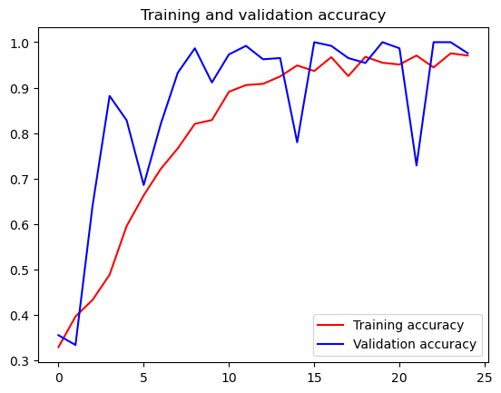

# TensorFlow训练石头剪刀布

**1.解压下载的数据集**


```python
import os
import zipfile
local_zip = 'E:/download/rps.zip'
zip_ref = zipfile.ZipFile(local_zip, 'r')
zip_ref.extractall('E:/download/')
zip_ref.close()

local_zip = 'E:/download/rps-test-set.zip'
zip_ref = zipfile.ZipFile(local_zip, 'r')
zip_ref.extractall('E:/download/')
zip_ref.close()

```

**2.检测数据集解压结果，打印相关信息**


```python
rock_dir = os.path.join('E:/download/rps/rock')
paper_dir = os.path.join('E:/download/rps/paper')
scissors_dir = os.path.join('E:/download/rps/scissors')

print('total training rock images:', len(os.listdir(rock_dir)))
print('total training paper images:', len(os.listdir(paper_dir)))
print('total training scissors images:', len(os.listdir(scissors_dir)))

rock_files = os.listdir(rock_dir)
print(rock_files[:10])

paper_files = os.listdir(paper_dir)
print(paper_files[:10])

scissors_files = os.listdir(scissors_dir)
print(scissors_files[:10])

```

    total training rock images: 840
    total training paper images: 840
    total training scissors images: 840
    ['rock01-000.png', 'rock01-001.png', 'rock01-002.png', 'rock01-003.png', 'rock01-004.png', 'rock01-005.png', 'rock01-006.png', 'rock01-007.png', 'rock01-008.png', 'rock01-009.png']
    ['paper01-000.png', 'paper01-001.png', 'paper01-002.png', 'paper01-003.png', 'paper01-004.png', 'paper01-005.png', 'paper01-006.png', 'paper01-007.png', 'paper01-008.png', 'paper01-009.png']
    ['scissors01-000.png', 'scissors01-001.png', 'scissors01-002.png', 'scissors01-003.png', 'scissors01-004.png', 'scissors01-005.png', 'scissors01-006.png', 'scissors01-007.png', 'scissors01-008.png', 'scissors01-009.png']
    

**3.各打印两张石头剪刀布训练集的图片**


```python
%matplotlib inline

import matplotlib.pyplot as plt
import matplotlib.image as mpimg

pic_index = 2

next_rock = [os.path.join(rock_dir, fname) 
                for fname in rock_files[pic_index-2:pic_index]]
next_paper = [os.path.join(paper_dir, fname) 
                for fname in paper_files[pic_index-2:pic_index]]
next_scissors = [os.path.join(scissors_dir, fname) 
                for fname in scissors_files[pic_index-2:pic_index]]

for i, img_path in enumerate(next_rock+next_paper+next_scissors):
  #print(img_path)
  img = mpimg.imread(img_path)
  plt.imshow(img)
  plt.axis('Off')
  plt.show()

```
    

    

     

       

      

      

    
**4.调用TensorFlow的keras进行数据模型的训练和评估。**


```python
import tensorflow as tf
import keras_preprocessing
from keras_preprocessing import image
from keras_preprocessing.image import ImageDataGenerator

TRAINING_DIR = "E:/download/rps/"
training_datagen = ImageDataGenerator(
      rescale = 1./255,
	    rotation_range=40,
      width_shift_range=0.2,
      height_shift_range=0.2,
      shear_range=0.2,
      zoom_range=0.2,
      horizontal_flip=True,
      fill_mode='nearest')

VALIDATION_DIR = "E:/download/rps-test-set/"
validation_datagen = ImageDataGenerator(rescale = 1./255)

train_generator = training_datagen.flow_from_directory(
	TRAINING_DIR,
	target_size=(150,150),
	class_mode='categorical',
  batch_size=126
)

validation_generator = validation_datagen.flow_from_directory(
	VALIDATION_DIR,
	target_size=(150,150),
	class_mode='categorical',
  batch_size=126
)

model = tf.keras.models.Sequential([
    # Note the input shape is the desired size of the image 150x150 with 3 bytes color
    # This is the first convolution
    tf.keras.layers.Conv2D(64, (3,3), activation='relu', input_shape=(150, 150, 3)),
    tf.keras.layers.MaxPooling2D(2, 2),
    # The second convolution
    tf.keras.layers.Conv2D(64, (3,3), activation='relu'),
    tf.keras.layers.MaxPooling2D(2,2),
    # The third convolution
    tf.keras.layers.Conv2D(128, (3,3), activation='relu'),
    tf.keras.layers.MaxPooling2D(2,2),
    # The fourth convolution
    tf.keras.layers.Conv2D(128, (3,3), activation='relu'),
    tf.keras.layers.MaxPooling2D(2,2),
    # Flatten the results to feed into a DNN
    tf.keras.layers.Flatten(),
    tf.keras.layers.Dropout(0.5),
    # 512 neuron hidden layer
    tf.keras.layers.Dense(512, activation='relu'),
    tf.keras.layers.Dense(3, activation='softmax')
])


model.summary()

model.compile(loss = 'categorical_crossentropy', optimizer='rmsprop', metrics=['accuracy'])

history = model.fit(train_generator, epochs=25, steps_per_epoch=20, validation_data = validation_generator, verbose = 1, validation_steps=3)

model.save("rps.h5")

```

    c:\Users\16018\anaconda3\envs\tf\lib\site-packages\tensorflow\python\framework\dtypes.py:516: FutureWarning: Passing (type, 1) or '1type' as a synonym of type is deprecated; in a future version of numpy, it will be understood as (type, (1,)) / '(1,)type'.
      _np_qint8 = np.dtype([("qint8", np.int8, 1)])
    c:\Users\16018\anaconda3\envs\tf\lib\site-packages\tensorflow\python\framework\dtypes.py:517: FutureWarning: Passing (type, 1) or '1type' as a synonym of type is deprecated; in a future version of numpy, it will be understood as (type, (1,)) / '(1,)type'.
      _np_quint8 = np.dtype([("quint8", np.uint8, 1)])
    c:\Users\16018\anaconda3\envs\tf\lib\site-packages\tensorflow\python\framework\dtypes.py:518: FutureWarning: Passing (type, 1) or '1type' as a synonym of type is deprecated; in a future version of numpy, it will be understood as (type, (1,)) / '(1,)type'.
      _np_qint16 = np.dtype([("qint16", np.int16, 1)])
    c:\Users\16018\anaconda3\envs\tf\lib\site-packages\tensorflow\python\framework\dtypes.py:519: FutureWarning: Passing (type, 1) or '1type' as a synonym of type is deprecated; in a future version of numpy, it will be understood as (type, (1,)) / '(1,)type'.
      _np_quint16 = np.dtype([("quint16", np.uint16, 1)])
    c:\Users\16018\anaconda3\envs\tf\lib\site-packages\tensorflow\python\framework\dtypes.py:520: FutureWarning: Passing (type, 1) or '1type' as a synonym of type is deprecated; in a future version of numpy, it will be understood as (type, (1,)) / '(1,)type'.
      _np_qint32 = np.dtype([("qint32", np.int32, 1)])
    c:\Users\16018\anaconda3\envs\tf\lib\site-packages\tensorflow\python\framework\dtypes.py:525: FutureWarning: Passing (type, 1) or '1type' as a synonym of type is deprecated; in a future version of numpy, it will be understood as (type, (1,)) / '(1,)type'.
      np_resource = np.dtype([("resource", np.ubyte, 1)])
    c:\Users\16018\anaconda3\envs\tf\lib\site-packages\tensorboard\compat\tensorflow_stub\dtypes.py:541: FutureWarning: Passing (type, 1) or '1type' as a synonym of type is deprecated; in a future version of numpy, it will be understood as (type, (1,)) / '(1,)type'.
      _np_qint8 = np.dtype([("qint8", np.int8, 1)])
    c:\Users\16018\anaconda3\envs\tf\lib\site-packages\tensorboard\compat\tensorflow_stub\dtypes.py:542: FutureWarning: Passing (type, 1) or '1type' as a synonym of type is deprecated; in a future version of numpy, it will be understood as (type, (1,)) / '(1,)type'.
      _np_quint8 = np.dtype([("quint8", np.uint8, 1)])
    c:\Users\16018\anaconda3\envs\tf\lib\site-packages\tensorboard\compat\tensorflow_stub\dtypes.py:543: FutureWarning: Passing (type, 1) or '1type' as a synonym of type is deprecated; in a future version of numpy, it will be understood as (type, (1,)) / '(1,)type'.
      _np_qint16 = np.dtype([("qint16", np.int16, 1)])
    c:\Users\16018\anaconda3\envs\tf\lib\site-packages\tensorboard\compat\tensorflow_stub\dtypes.py:544: FutureWarning: Passing (type, 1) or '1type' as a synonym of type is deprecated; in a future version of numpy, it will be understood as (type, (1,)) / '(1,)type'.
      _np_quint16 = np.dtype([("quint16", np.uint16, 1)])
    c:\Users\16018\anaconda3\envs\tf\lib\site-packages\tensorboard\compat\tensorflow_stub\dtypes.py:545: FutureWarning: Passing (type, 1) or '1type' as a synonym of type is deprecated; in a future version of numpy, it will be understood as (type, (1,)) / '(1,)type'.
      _np_qint32 = np.dtype([("qint32", np.int32, 1)])
    c:\Users\16018\anaconda3\envs\tf\lib\site-packages\tensorboard\compat\tensorflow_stub\dtypes.py:550: FutureWarning: Passing (type, 1) or '1type' as a synonym of type is deprecated; in a future version of numpy, it will be understood as (type, (1,)) / '(1,)type'.
      np_resource = np.dtype([("resource", np.ubyte, 1)])
    

    Found 2520 images belonging to 3 classes.
    Found 372 images belonging to 3 classes.
    WARNING:tensorflow:From c:\Users\16018\anaconda3\envs\tf\lib\site-packages\tensorflow\python\ops\init_ops.py:1251: calling VarianceScaling.__init__ (from tensorflow.python.ops.init_ops) with dtype is deprecated and will be removed in a future version.
    Instructions for updating:
    Call initializer instance with the dtype argument instead of passing it to the constructor
    Model: "sequential"
    _________________________________________________________________
    Layer (type)                 Output Shape              Param #   
    =================================================================
    conv2d (Conv2D)              (None, 148, 148, 64)      1792      
    _________________________________________________________________
    max_pooling2d (MaxPooling2D) (None, 74, 74, 64)        0         
    _________________________________________________________________
    conv2d_1 (Conv2D)            (None, 72, 72, 64)        36928     
    _________________________________________________________________
    max_pooling2d_1 (MaxPooling2 (None, 36, 36, 64)        0         
    _________________________________________________________________
    conv2d_2 (Conv2D)            (None, 34, 34, 128)       73856     
    _________________________________________________________________
    max_pooling2d_2 (MaxPooling2 (None, 17, 17, 128)       0         
    _________________________________________________________________
    conv2d_3 (Conv2D)            (None, 15, 15, 128)       147584    
    _________________________________________________________________
    max_pooling2d_3 (MaxPooling2 (None, 7, 7, 128)         0         
    _________________________________________________________________
    flatten (Flatten)            (None, 6272)              0         
    _________________________________________________________________
    dropout (Dropout)            (None, 6272)              0         
    _________________________________________________________________
    dense (Dense)                (None, 512)               3211776   
    _________________________________________________________________
    dense_1 (Dense)              (None, 3)                 1539      
    =================================================================
    Total params: 3,473,475
    Trainable params: 3,473,475
    Non-trainable params: 0
    _________________________________________________________________
    Epoch 1/25
    20/20 [==============================] - 50s 3s/step - loss: 1.4632 - acc: 0.3286 - val_loss: 1.0911 - val_acc: 0.3548
    Epoch 2/25
    20/20 [==============================] - 48s 2s/step - loss: 1.1065 - acc: 0.3960 - val_loss: 1.0888 - val_acc: 0.3333
    Epoch 3/25
    20/20 [==============================] - 50s 2s/step - loss: 1.2126 - acc: 0.4325 - val_loss: 0.9749 - val_acc: 0.6398
    Epoch 4/25
    20/20 [==============================] - 50s 3s/step - loss: 1.0307 - acc: 0.4881 - val_loss: 0.6736 - val_acc: 0.8817
    Epoch 5/25
    20/20 [==============================] - 50s 3s/step - loss: 0.8935 - acc: 0.5952 - val_loss: 0.4791 - val_acc: 0.8280
    Epoch 6/25
    20/20 [==============================] - 50s 2s/step - loss: 0.7942 - acc: 0.6627 - val_loss: 0.4943 - val_acc: 0.6855
    Epoch 7/25
    20/20 [==============================] - 50s 3s/step - loss: 0.6020 - acc: 0.7210 - val_loss: 0.3155 - val_acc: 0.8199
    Epoch 8/25
    20/20 [==============================] - 51s 3s/step - loss: 0.5451 - acc: 0.7663 - val_loss: 0.1844 - val_acc: 0.9328
    Epoch 9/25
    20/20 [==============================] - 51s 3s/step - loss: 0.4423 - acc: 0.8202 - val_loss: 0.1014 - val_acc: 0.9866
    Epoch 10/25
    20/20 [==============================] - 52s 3s/step - loss: 0.4100 - acc: 0.8286 - val_loss: 0.1792 - val_acc: 0.9113
    Epoch 11/25
    20/20 [==============================] - 51s 3s/step - loss: 0.2976 - acc: 0.8909 - val_loss: 0.0868 - val_acc: 0.9731
    Epoch 12/25
    20/20 [==============================] - 51s 3s/step - loss: 0.2538 - acc: 0.9056 - val_loss: 0.0350 - val_acc: 0.9919
    Epoch 13/25
    20/20 [==============================] - 54s 3s/step - loss: 0.2614 - acc: 0.9083 - val_loss: 0.0915 - val_acc: 0.9624
    Epoch 14/25
    20/20 [==============================] - 57s 3s/step - loss: 0.2111 - acc: 0.9246 - val_loss: 0.1071 - val_acc: 0.9651
    Epoch 15/25
    20/20 [==============================] - 56s 3s/step - loss: 0.1475 - acc: 0.9488 - val_loss: 0.5357 - val_acc: 0.7796
    Epoch 16/25
    20/20 [==============================] - 56s 3s/step - loss: 0.1914 - acc: 0.9365 - val_loss: 0.0213 - val_acc: 1.0000
    Epoch 17/25
    20/20 [==============================] - 52s 3s/step - loss: 0.0931 - acc: 0.9671 - val_loss: 0.0204 - val_acc: 0.9919
    Epoch 18/25
    20/20 [==============================] - 57s 3s/step - loss: 0.2522 - acc: 0.9254 - val_loss: 0.0767 - val_acc: 0.9651
    Epoch 19/25
    20/20 [==============================] - 56s 3s/step - loss: 0.0940 - acc: 0.9679 - val_loss: 0.1344 - val_acc: 0.9543
    Epoch 20/25
    20/20 [==============================] - 52s 3s/step - loss: 0.1272 - acc: 0.9548 - val_loss: 0.0256 - val_acc: 1.0000
    Epoch 21/25
    20/20 [==============================] - 52s 3s/step - loss: 0.1438 - acc: 0.9508 - val_loss: 0.0324 - val_acc: 0.9866
    Epoch 22/25
    20/20 [==============================] - 52s 3s/step - loss: 0.0876 - acc: 0.9706 - val_loss: 0.5585 - val_acc: 0.7285
    Epoch 23/25
    20/20 [==============================] - 52s 3s/step - loss: 0.1633 - acc: 0.9444 - val_loss: 0.0152 - val_acc: 1.0000
    Epoch 24/25
    20/20 [==============================] - 53s 3s/step - loss: 0.0722 - acc: 0.9754 - val_loss: 0.0118 - val_acc: 1.0000
    Epoch 25/25
    20/20 [==============================] - 53s 3s/step - loss: 0.0956 - acc: 0.9706 - val_loss: 0.0441 - val_acc: 0.9758
    

**5.绘制训练和验证结果的相关信息**


```python
import matplotlib.pyplot as plt
acc = history.history['acc']
val_acc = history.history['val_acc']
loss = history.history['loss']
val_loss = history.history['val_loss']

epochs = range(len(acc))

plt.plot(epochs, acc, 'r', label='Training accuracy')
plt.plot(epochs, val_acc, 'b', label='Validation accuracy')
plt.title('Training and validation accuracy')
plt.legend(loc=0)
plt.figure()
plt.show()


```
    


    <Figure size 640x480 with 0 Axes>

**6.遇到问题**

问题：报错信息之KeyError: ‘accuracy’

因为keras库老版本中的参数不是accuracy，而是acc，将参数accuracy替换为acc
