# 基于TensorFlow Lite实现的Android花卉识别应用

### Android studio连接真机

#### 1.电脑设置

 **1.1 检查必要工具是否下载**

Android studio——>右上角的立方体标志“SDK Manager”——>点击“SDK Tools”

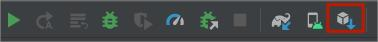

检查是否下载“Goolge USB Driver”

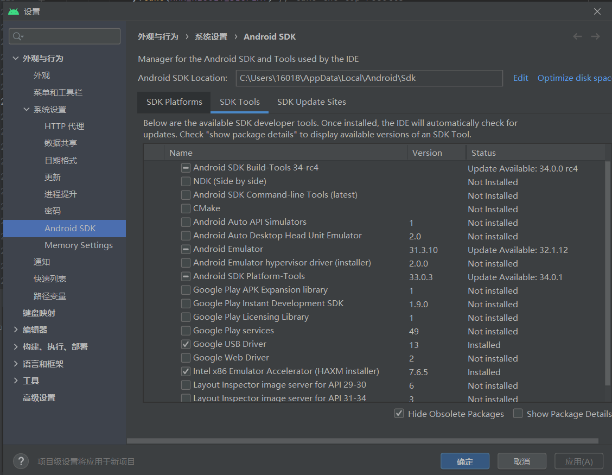

 **1.2 驱动安装**

进入设备管理器

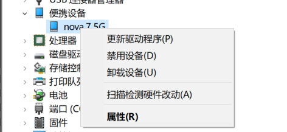

选择更新驱动程序

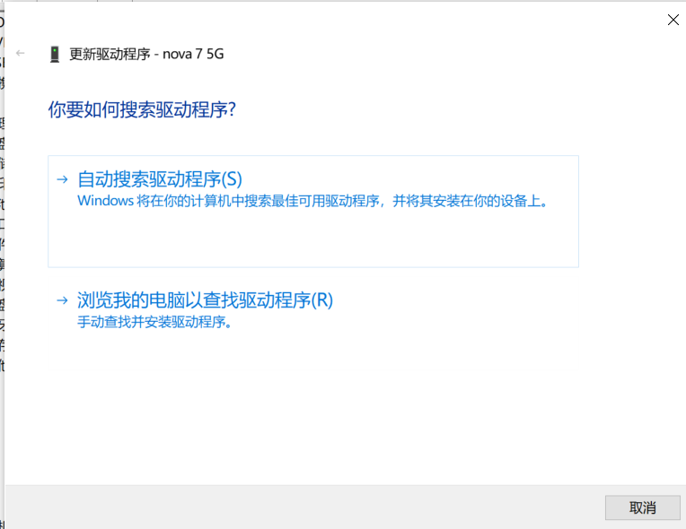

选择浏览我的电脑以查找驱动程序

填写自己的“usb_driver”的位置

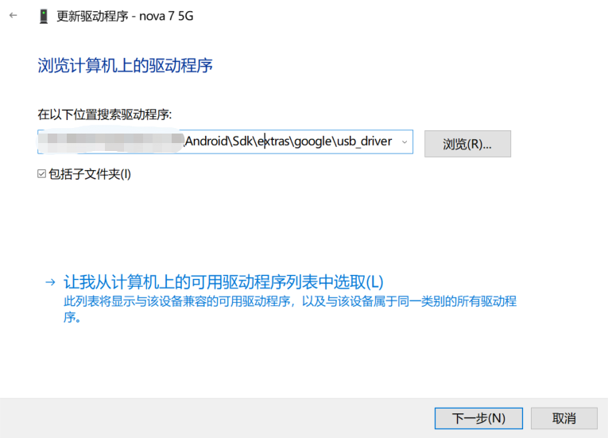

 **1.3 手机打开开发者模式**

设置——>关于手机——>版本号，点击版本号五六次会显示进入开发者模式。

找到“开发者选项”打开“USB调试”，打开“仅充电模式下允许ADB调试”，手机用USB数据线连接到电脑手机自动出现选项——选择传输文件。

 **1.4 选择设备**


### 2.运行初始代码

项目包含两个module：finish 和 start，finish模块是已经完成的项目，start则是本项目实践的模块。

选择真实物理机运行start模块

初始效果图：

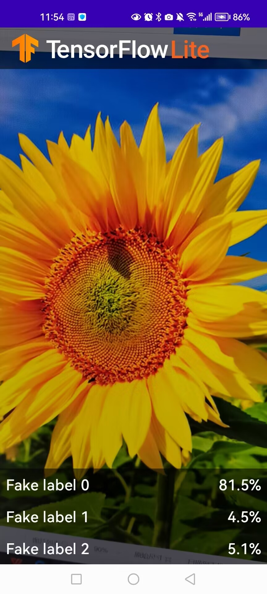


### 3.向应用中添加TensorFlow Lite

**3.1 选择“start”模块**

**3.2 右键“start”模块，或者选择File，然后New>Other>TensorFlow Lite Model**

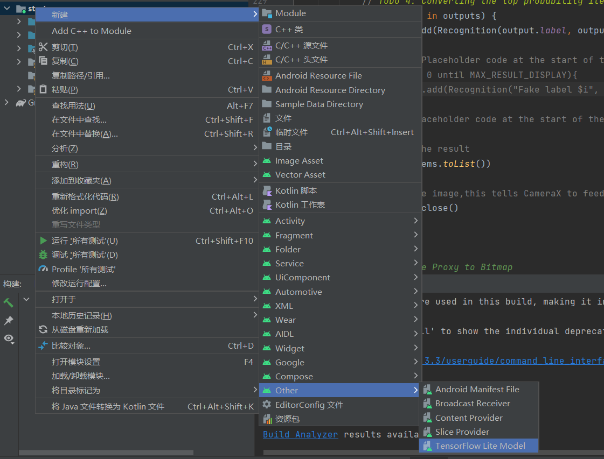

选择已经下载的自定义的训练模型>这里选择finish模块中ml文件下的FlowerModel.tflite。

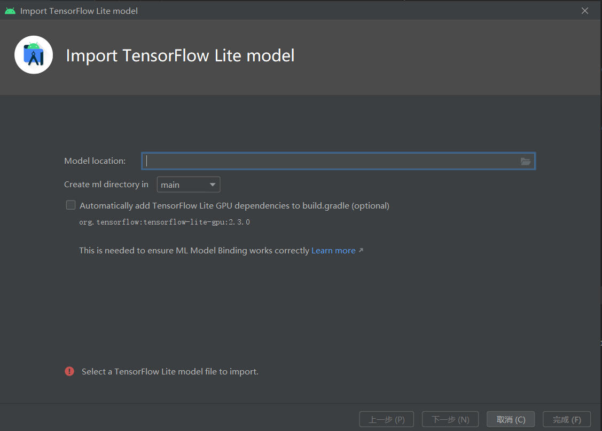

点击“Finish”完成模型导入，系统将自动下载模型的依赖包并将依赖项添加至模块的build.gradle文件。
 
**3.3 最终TensorFlow Lite模型被成功导入，并生成摘要信息**

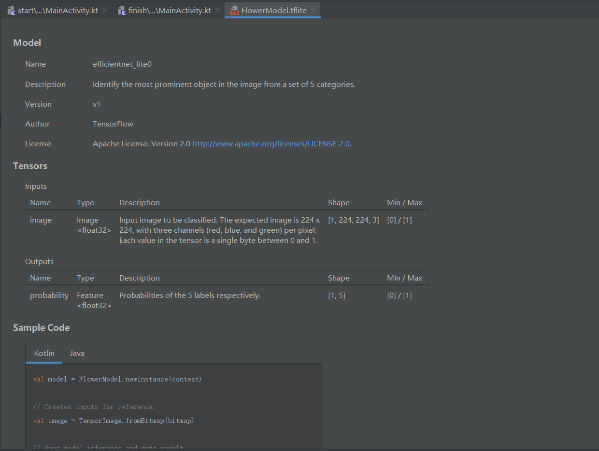

### 4.检查代码中的TODO项

本项目初始代码中包括了若干的TODO项，以导航项目中未完成之处。为了方便起见，首先查看TODO列表视图，View>Tool Windows>TODO.

默认情况下了列出项目所有的TODO项，进一步按照模块分组（Group By）

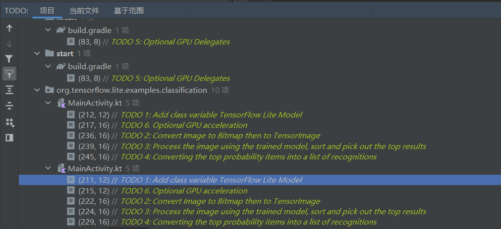

### 5.添加代码重新运行APP

**5.1 定位“start”模块MainActivity.kt文件的TODO 1，添加初始化训练模型的代码**

```kotlin
 private class ImageAnalyzer(ctx: Context, private val listener: RecognitionListener) :
        ImageAnalysis.Analyzer {

        // TODO 1: Add class variable TensorFlow Lite Model
        // Initializing the flowerModel by lazy so that it runs in the same thread when the process
        // method is called.
        private val flowerModel = FlowerModel.newInstance(ctx)
        ...
    }
```

**5.2 在CameraX的analyze方法内部，需要将摄像头的输入ImageProxy转化为Bitmap对象，并进一步转化为TensorImage 对象**

```kotlin
override fun analyze(imageProxy: ImageProxy) {
        ...
        val items = mutableListOf<Recognition>()

        // TODO 2: Convert Image to Bitmap then to TensorImage
        val tfImage = TensorImage.fromBitmap(toBitmap(imageProxy))
  }
```

**5.3 对图像进行处理并生成结果，主要包含下述操作**

* 按照属性score对识别结果按照概率从高到低排序
* 列出最高k种可能的结果，k的结果由常量MAX_RESULT_DISPLAY定义

```kotlin
// TODO 3: Process the image using the trained model, sort and pick out the top results
val outputs = flowerModel.process(tfImage)
    .probabilityAsCategoryList.apply {
        sortByDescending { it.score } // Sort with highest confidence first
    }.take(MAX_RESULT_DISPLAY) // take the top results

```

**5.4 将识别的结果加入数据对象Recognition 中，包含label和score两个元素。后续将用于RecyclerView的数据显示**

```kotlin
// TODO 4: Converting the top probability items into a list of recognitions
        for (output in outputs) {
            items.add(Recognition(output.label, output.score))
        }

```

**5.5 将原先用于虚拟显示识别结果的代码注释掉或者删除**

```kotlin
// START - Placeholder code at the start of the codelab. Comment this block of code out.
        for (i in 0 until MAX_RESULT_DISPLAY){
            items.add(Recognition("Fake label $i", Random.nextFloat()))
        }
// END - Placeholder code at the start of the codelab. Comment this block of code out.

```

### 6.以物理设备重新运行start模块

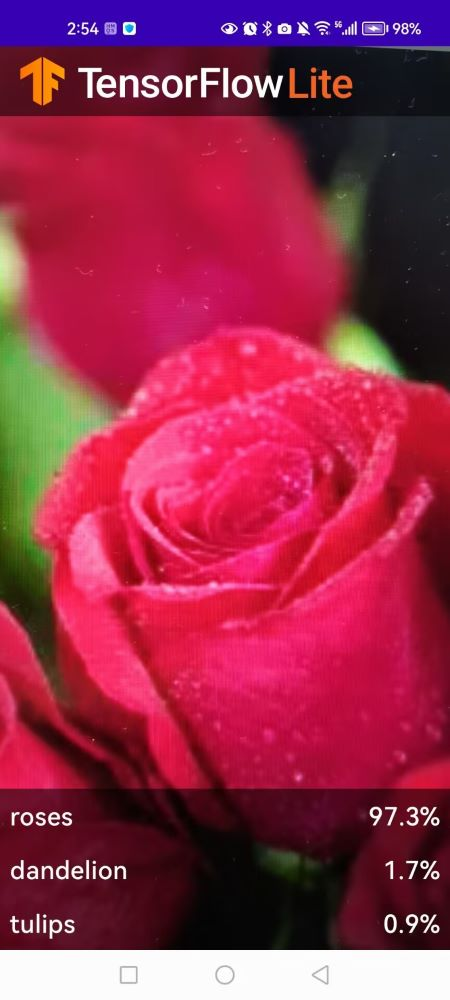
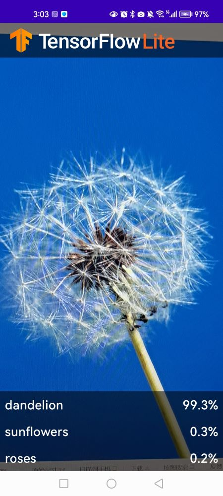
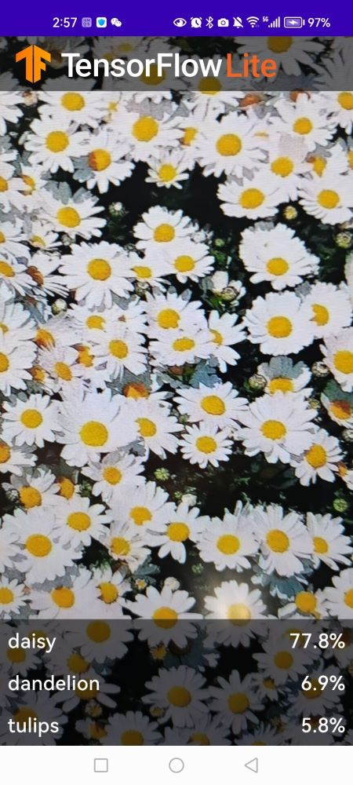
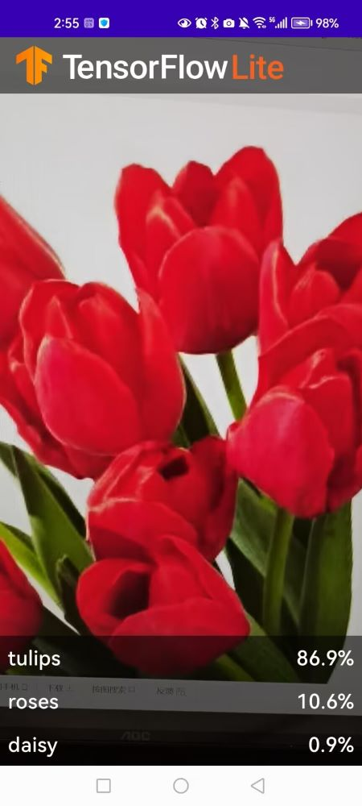
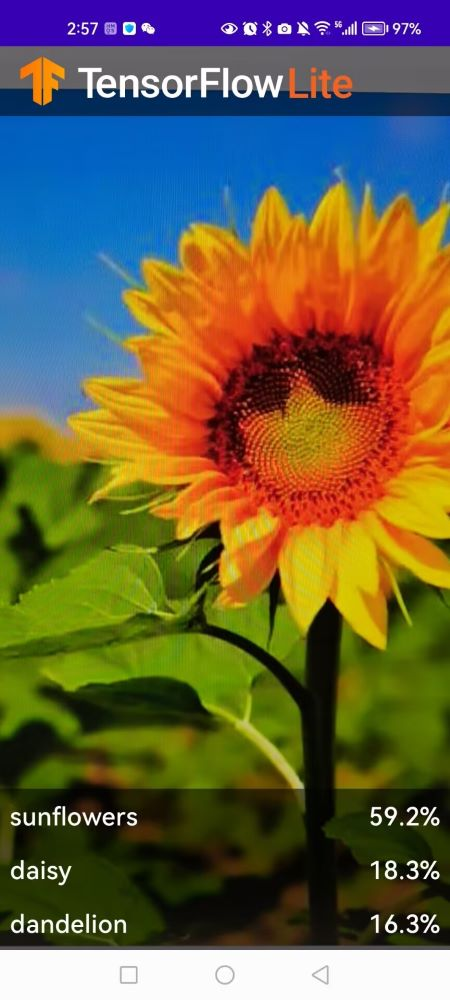